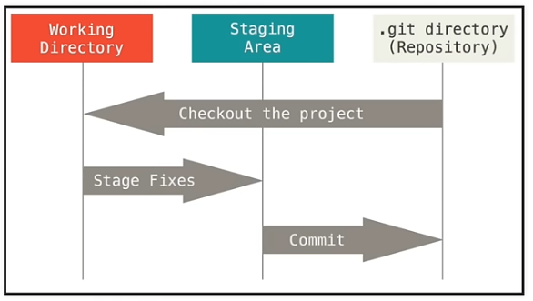

<link rel="stylesheet" href="/home/cestien/memoria/template/nota_template/miestilo.css">


# Notas sobre git 
## Antes que nada
  - Setear en la máquina local el user y el mail porque sino vcode no los conoce. Se puede hacer local para un proyecto determinado o global para todos los proyectos que el usuario haga en esa máquina ya que modifica el archivo `~/.gitconfig`. Mejor hacerlo global. Esto se hace en una terminal:
 ```bash
 git config  --global user.name cestien
 git config  --global user.email cestien@fi.uba.ar
 ```
   - Si estoy la facu agregar el proxy haciendo:
   ```bash
   git config --global https.proxy http://proxy.fi.uba.ar:8080
   git config --global http.proxy http://proxy.fi.uba.ar:8080
  ```
Esto se puede corroborar haciendo se puede corroborar haciendo
```bash
git config --global --list
```

## Tracking de un directorio local
Nuestro proyecto es un directorio que llamaremos `source_dir` 
```bash
cd source_dir
git init
```
esto crea un directorio `.git` en dicho directorio, si lo borramos, borramos todo lo relacionado con el tracking. 

Creamos un archivo de texto llamada `.gitignore` el cual contiene una lista con los archivos o directorios dentro del proyecto que no nos interesa trackear.

```bash
git status
```
Nos lista solamente los archivos no ignorados y nos dice cuales están *confirmados*  (commited), es decir cuales estan siendo traqueados y cuales no.

Los archivos en el proyecto se agrupan del siguiente modo



  - El área en la cual están todos los archivos exceptuando los excluidos se llama *working area*. 
  - Los archivos que nos interesa trackear de esta area estan en lo que se llama *staging area*. Para agregar archivos de la working area a la staging area hacemos:
    ```bash
    git add file1
    git add file2
    git add -A
    git add file1 file2
    ```
    Para sacar archivos de la staging area:
    ```bash
    git reset file1
    git reset
    ```

Los cambios que hagamos en archivos de  la staging area serán traqueados por git y confirmados en el repositorio haciendo:
```bash
git commit -m "Descripción"
git log
```
Donde *Descripción* es una descripción de los cambios realizados en el/los archivos desde la última confirmación hasta esta.  Una vez que ejecutemos git commit se vacía el área de staging y se podrá repetir el proceso con cada modificación que hagamos en un archivo del directorio de trabajo. `git log` me da detalles del commit que acabamos de hacer.

## Tracking de un directorio remoto
El directorio podría ser efectivamente remoto o estar en otro directorio local
```bash
git clone <url> <donde clonar>
git clone ../remote_dir .
```
En nuestro caso el directorio remoto será `source_dir` y el local `dest_dir`. Entonces para clonar el source_dir en el dest_dir hacemos:
```bash
cd dest_dir
git clone ../source_dir .
```

### Login con token
Para hacer cosas desde la terminal local en github me pide logearme con un token. El token tiene una duración finita y yo lo puse para que dure 3 meses. Para generarlo hicimos los siguientes pasos:
  - Clikear en el avatar de mi cuenta
  - Volvear a clikear en el avatar
  - En el menu de settings al final dice <>developer settings. Entrar ahi
  - Ir a personal acces tokens
  - Ir a Tokens (classic)
  - generate new token (classic)
  - Una vez que está generado copiarlo al clipboar

Instalar el program gh con apt y ejecutar la linea
```bash
gh auth login
```
En un momento me va a pedir que ponga el token que generamos en lugar del password

## El proceso completo
Tenemos un directorio asus y el directorio mafalda. La idea es que ambos esten sincronizados. 
  - Ir al directorio `asus`
  - hacer: `git init`. Es decir hacer que el directorio asus sea un repositorio git
  - hacer: `git add .`. Es decir, pasar a la staging area todos los archivos para ser trackeados
  - si quiero sacar algun file hacemos `git reset 'timit/train.yaml'`
  - hacer `git commit -m "En asus"` 
  - Crear un nuevo repositorio en github y copiar el link
  - hacer: `git remote add origin https://github.com/cestien/asus.git` para asociarlo al directorio local
  - hacer: `git remote -v para verificar que se haya mandado
  - git branch -M main
  - hacer: `git push -u origin main` para mandar al github

## El proceso completo desde vcode
Tenemos github en la nube y tenemos dos máquinas A y B. Las situaciones que analizamos son las siguientes:
  - La máquina A sube un directorio a github como nuevo repositorio
    - Abrimos el directorio de asus que va a ser nuestro repositorio. Ejemplo el directorio `cestien/trabajo/zero-res/zrc/tutorial_notebooks/pytorch`
    - En el menu de source control clickeamos Initialize repository.
    - Cliqueamos commit
    - Escribimos un comentario, salvamos y cerramos el archivo `COMMIT_EDITMSG`
    - Cliqueamos Publish branch (podemos elegir si va a ser público o privado).
  - La máquina B trae el repositorio creado por la máquina A a un directorio local
    - Hacemos git clone `https://github.com/cestien/pytorch.git`
  - Modificamos algo en la máquina B y lo subimos a github (push)
    - En el menu de source control clickeamos commit
    - Escribimos un comentario, salvamos y cerramos el archivo `COMMIT_EDITMSG`
    - Clikeamos sync changes
  - Descargamos en la máquina A el contenido de github de modo de ver la modifiación que hizo A (pull)
    - En el menu de source control clickeamos Sync changes.

  - Modificamos algo en la máquina B y lo subimos a la máquina A:
    - Subir a github una modificación hecha en el directorio local (push)
      - En el menu de source control clickeamos commit
      - Escribimos un comentario, salvamos y cerramos el archivo `COMMIT_EDITMSG`
      - Clikeamos sync changes
    - Traer del repositorio `pytorch`de github al directorio local (pull). 


  

